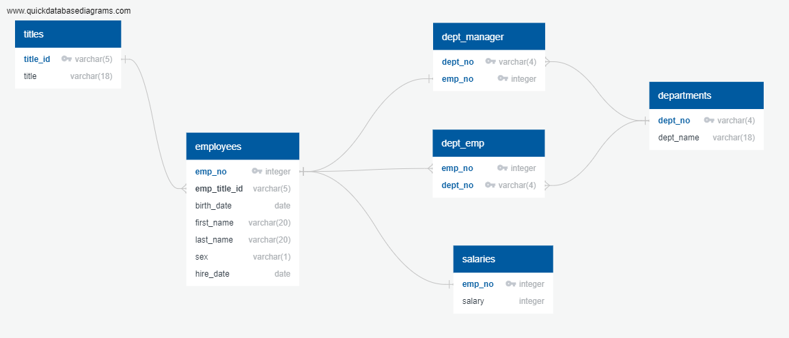

# Create an SQL database and analyse the data

### **Overview**
Using data for a fictional company created an SQL database from six CSV files and answered questions about the data.

### **Aspects Covered**
- Creating an entity relationship diagram (ERD), specifying data types, primary keys, foreign keys, and other constraints
- Developing table schema
- Importing csv files into the corresponding SQL table
- Writing queries to analyse the data and answer questions

### **Visualisations**

### **Folder structure**
- *1_entity_relationship_diagram* - is the ERD
- *2_table_schemata* - code used to create the tables and import the data
- *3_queries* - the code used for the queries
- The folder *queries_output* contains the output from the queries as individual csv files.  The number of rows in each file is noted as part of the file name.
- The folder *data* contains the data files used for this project.

 

---

### **Contact**
Email: kymcoleman@gmail.com

---
